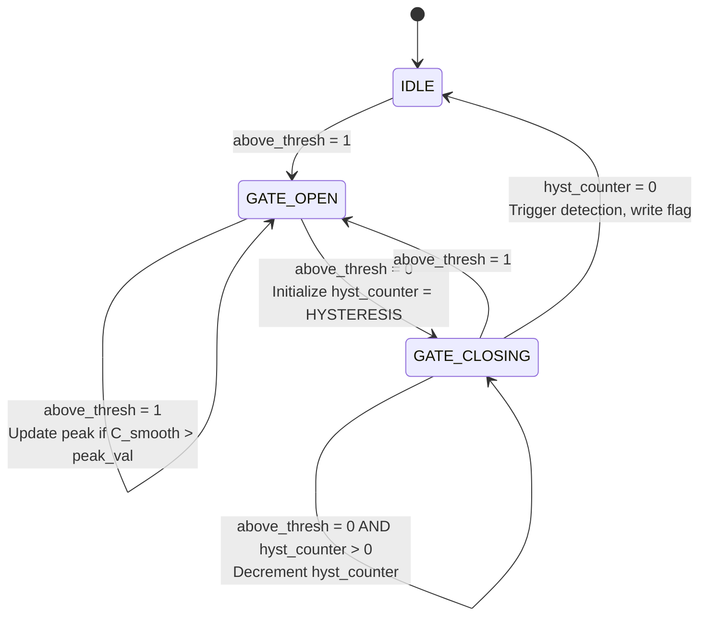

# Minn Preamble Detector Architecture Specification

## Design Parameters (Confirmed)

### OFDM Parameters
- **NFFT**: 2048 (FFT size)
- **Q**: 512 (quarter length = NFFT/4)
- **CP**: 512 (cyclic prefix length)
- **Active Subcarriers**: 1200 (every 4th subcarrier)
- **Preamble Structure**: [A A A A] → [A A -A -A] (Minn classic)

### RTL Parameters
- **W_IN**: 12 bits (I/Q input width)
- **THRESHOLD**: 0x1800 (Q1.15 format, configurable parameter)
- **IIR_SHIFT**: 3 (S=3 for smoother)
- **HYSTERESIS**: 2 samples
- **TIMING_OFFSET**: 0 (configurable, can be negative)
- **OUTPUT_DELAY**: 2048 (N = NFFT)
- **DEPTH**: 2048 + 64 = 2112 (output buffer with margin)

## Bit Width Calculations

Based on W_IN=12 and Q=512:

### Power and Product Widths
- **w (power)**: W_w = 2·W_IN + 1 = 25 bits
- **p (quarter-lag product real)**: W_p = 2·W_IN + 1 = 25 bits

### Accumulator Widths
- **E (Q-sum of power, single antenna)**: W_E = W_w + ⌈log₂(Q)⌉ = 25 + 9 = 34 bits
- **R (Q-sum of product, single antenna)**: W_R = W_p + ⌈log₂(Q)⌉ = 25 + 9 = 34 bits

### Combined Widths
- **E_tot (across 3 quarters, 2 antennas)**:
  - Per antenna 3-quarter sum: W_E + 2 = 36 bits
  - Both antennas: W_E_tot = 37 bits
  
- **C (correlation, 2 quarters, 2 antennas)**:
  - Per antenna 2-quarter sum: W_R + 1 = 35 bits
  - Both antennas: W_C = 36 bits

### Threshold Computation
- **T·E_tot**: 16 bits (Q1.15) × 37 bits = 53 bits (before truncation)
- **C_smooth**: 36 bits (IIR smoother doesn't increase width significantly)

## Module Hierarchy

```
minn_preamble_detector (top-level)
├── Parameters: NFFT, W_IN, THRESHOLD, IIR_SHIFT, HYSTERESIS, TIMING_OFFSET, OUTPUT_DELAY
├── Antenna 0 Datapath
│   ├── Q-delay FIFO (complex, Q=512 deep)
│   ├── Quarter-lag product (real part only)
│   ├── Running sum R0 with FIFO (Q=512 deep, 25-bit entries)
│   ├── Power computation
│   ├── Running sum E0 with FIFO (Q=512 deep, 25-bit entries)
│   ├── R0 Q-delay for R0[n-Q]
│   ├── E0 Q-delay for E0[n-Q]
│   └── E0 2Q-delay for E0[n-2Q]
├── Antenna 1 Datapath (identical to Antenna 0)
├── Cross-Antenna Combiner
│   ├── Sum R0 + R0_d1 + R1 + R1_d1 → C
│   ├── Sum E0 + E0_d1 + E0_d2 + E1 + E1_d2 + E1_d2 → E_tot
│   ├── Clamp C to C_pos (max with 0)
│   ├── IIR Smoother → C_smooth
│   ├── Threshold multiply: T × E_tot
│   └── Comparator → above_thresh
├── Gate & Peak Detector FSM
│   ├── States: IDLE, GATE_OPEN, GATE_CLOSING
│   ├── Tracks: peak_val, peak_wptr, hysteresis_counter
│   └── Outputs: detection_flag, flag_addr
└── Output Circular Buffer
    ├── Dual-port BRAM (DEPTH × (4×W_IN + 1 flag bit))
    ├── Port A: sequential writes
    ├── Port B: random flag writes
    └── Read pointer trails write by OUTPUT_DELAY
```

## Interface Specification

### Module Ports

```systemverilog
module minn_preamble_detector #(
    parameter int NFFT          = 2048,    // FFT size
    parameter int W_IN          = 12,      // Input I/Q bit width
    parameter int THRESHOLD     = 16'h1800,// Q1.15 threshold (0.09375)
    parameter int IIR_SHIFT     = 3,       // Smoother shift amount
    parameter int HYSTERESIS    = 2,       // Gate close hysteresis
    parameter int TIMING_OFFSET = 0,       // Signed offset for flag alignment
    parameter int OUTPUT_DELAY  = 2048,    // Output FIFO delay (typically = NFFT)
    
    // Derived parameters (do not set at instantiation)
    parameter int Q             = NFFT/4,
    parameter int DEPTH         = OUTPUT_DELAY + 64
) (
    input  logic                    clk,
    input  logic                    rst,
    
    // Input samples (continuous stream)
    input  logic                    in_valid,
    input  logic signed [W_IN-1:0]  ch0_i,
    input  logic signed [W_IN-1:0]  ch0_q,
    input  logic signed [W_IN-1:0]  ch1_i,
    input  logic signed [W_IN-1:0]  ch1_q,
    
    // Output samples (delayed stream with frame flag)
    output logic                    out_valid,
    output logic signed [W_IN-1:0]  out_ch0_i,
    output logic signed [W_IN-1:0]  out_ch0_q,
    output logic signed [W_IN-1:0]  out_ch1_i,
    output logic signed [W_IN-1:0]  out_ch1_q,
    output logic                    frame_start,
    
    // Optional debug outputs
    output logic [35:0]             dbg_metric,
    output logic [36:0]             dbg_energy,
    output logic                    dbg_above_thresh
);
```

## Memory and FIFO Requirements

### Per Antenna (×2 total)
1. **Complex Q-delay FIFO**: 512 × 24 bits = 12,288 bits (can use SRL)
2. **Product FIFO**: 512 × 25 bits = 12,800 bits
3. **Power FIFO**: 512 × 25 bits = 12,800 bits
4. **R delay (Q)**: 512 × 34 bits = 17,408 bits
5. **E delay (Q)**: 512 × 34 bits = 17,408 bits
6. **E delay (2Q)**: 512 × 34 bits = 17,408 bits

**Subtotal per antenna**: ~90 Kbits

### Shared Resources
1. **Output circular buffer**: 2112 × 49 bits = 103,488 bits (dual-port BRAM)

**Total memory**: ~280 Kbits (≈35 KB)

### DSP Usage (per antenna, ×2 total)
- 2 multipliers for quarter-lag product (p = I·I + Q·Q)
- 2 multipliers for power (w = I² + Q²)
- **Total**: 8 DSP slices

### Additional DSP
- 1 DSP for threshold multiply (T × E_tot)
- **Grand total**: 9 DSP slices

## FSM State Diagram



### FSM States
- **IDLE**: Waiting for metric to exceed threshold
- **GATE_OPEN**: Tracking peak value and position while above threshold
- **GATE_CLOSING**: Hysteresis countdown after going below threshold

### FSM Outputs
- **detection**: Single-cycle pulse when closing gate
- **flag_addr**: Address in output buffer to set frame_start flag
- **peak_wptr**: Write pointer value at peak detection

## Datapath Pipeline Stages

### Stage 0: Input
- Register ch0_i, ch0_q, ch1_i, ch1_q, in_valid

### Stage 1-2: Per-Antenna Processing
- Stage 1: Q-delay, compute p and w
- Stage 2: Update running sums R and E, push to FIFOs

### Stage 3: Generate Delayed Taps
- Extract R[n-Q], E[n-Q], E[n-2Q] from delay lines

### Stage 4: Cross-Antenna Combine
- Sum all R taps → C
- Sum all E taps → E_tot
- Clamp C → C_pos

### Stage 5: Smoothing and Threshold
- IIR smoother: C_smooth ← C_smooth + (C_pos - C_smooth) >> IIR_SHIFT
- Multiply: T × E_tot
- Compare: above_thresh = (C_smooth >= T × E_tot)

### Stage 6: Gate & Peak FSM
- Update FSM state
- Track peak_val and peak_wptr
- Generate detection flag

### Stage 7: Output Buffer Management
- Write current sample to buffer (port A)
- Write flag if detection occurred (port B)
- Read delayed sample from buffer
- Output delayed sample and flag

## Implementation Notes

### Fixed-Point Considerations
1. All multiplications should be signed
2. Accumulators should use saturating arithmetic where overflow is possible
3. Threshold value T is in Q1.15 format (1 sign bit, 15 fractional bits)
4. IIR smoother uses power-of-2 division (arithmetic right shift)

### Initialization and Warm-up
1. All FIFOs and delays must be initialized to zero
2. Warm-up period = 3Q = 1536 cycles for full delay line population
3. During warm-up, force comparator output to 0 (gate closed)
4. Output buffer begins reading after OUTPUT_DELAY cycles

### Timing Considerations
1. Critical path likely in cross-antenna adder tree or threshold multiply
2. May need pipeline register between combiner and threshold check
3. Output buffer should be dual-port true BRAM for concurrent read/write

### Test Strategy
1. **Unit tests**: Test individual blocks (delay, running sum, FSM)
2. **Integration test**: Perfect preamble, verify single detection
3. **Noise test**: Add AWGN, verify detection probability
4. **CFO test**: Apply frequency offset, verify detection degrades gracefully
5. **Plots**: Metric vs time, energy vs time, gate state, frame flags

## SystemVerilog Coding Standards

Following `verilog_guide.md`:
1. Use `logic` instead of `reg` for all registers
2. Use parameterized widths, no hardcoded integers
3. Use localparams for derived constants
4. Separate combinational and sequential always blocks
5. Use non-blocking assignments (<=) in clocked blocks
6. Use blocking assignments (=) in combinational blocks
7. Initialize all registers with initial values
8. Avoid X and Z except for explicitly uninitialized signals in testbench
9. Use ternary operators instead of if/else where possible
10. No `assign` statements except for wiring module outputs

## Next Steps

1. Implement individual sub-modules as separate files:
   - `minn_running_sum.sv` (generic running sum with FIFO)
   - `minn_antenna_datapath.sv` (per-antenna processing)
   - `minn_fsm.sv` (gate & peak detector)
   - `minn_output_buffer.sv` (dual-port circular buffer)

2. Integrate sub-modules in `minn_preamble_detector.sv`

3. Create Python test in `tests/test_minn_detector.py`:
   - Generate OFDM symbol with QPSK on every 4th subcarrier
   - Apply Minn structure: [A A -A -A]
   - Feed to detector
   - Plot metric, energy, detections

4. Verify timing and resource usage in synthesis reports